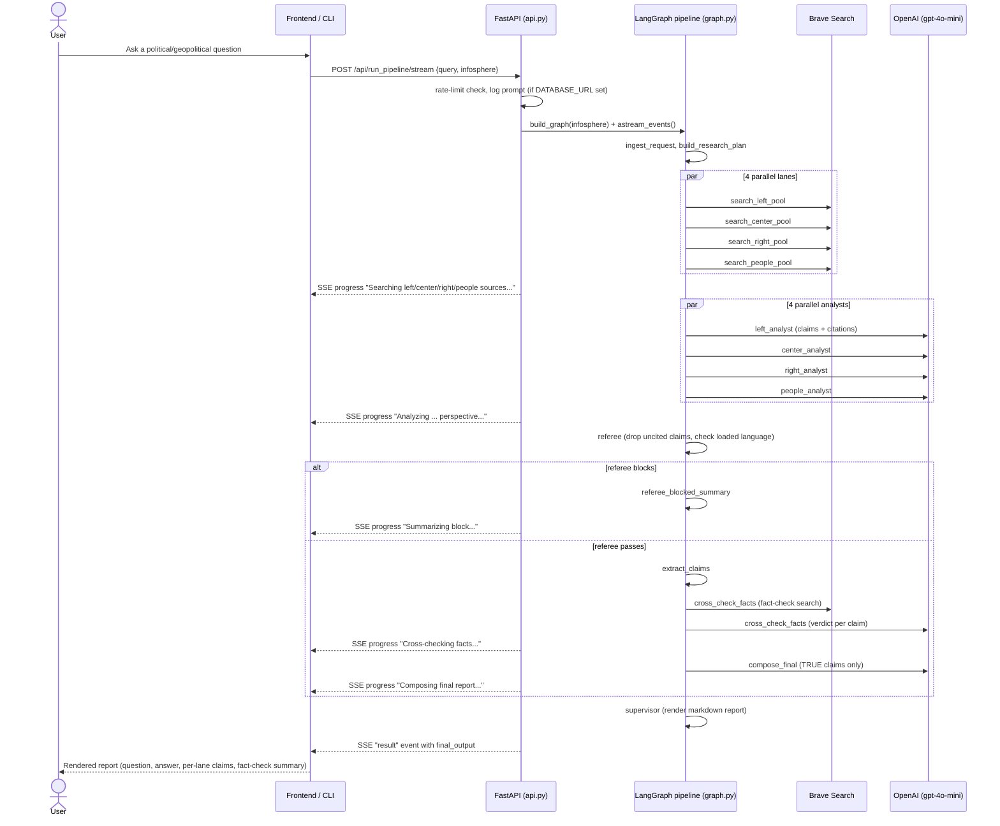
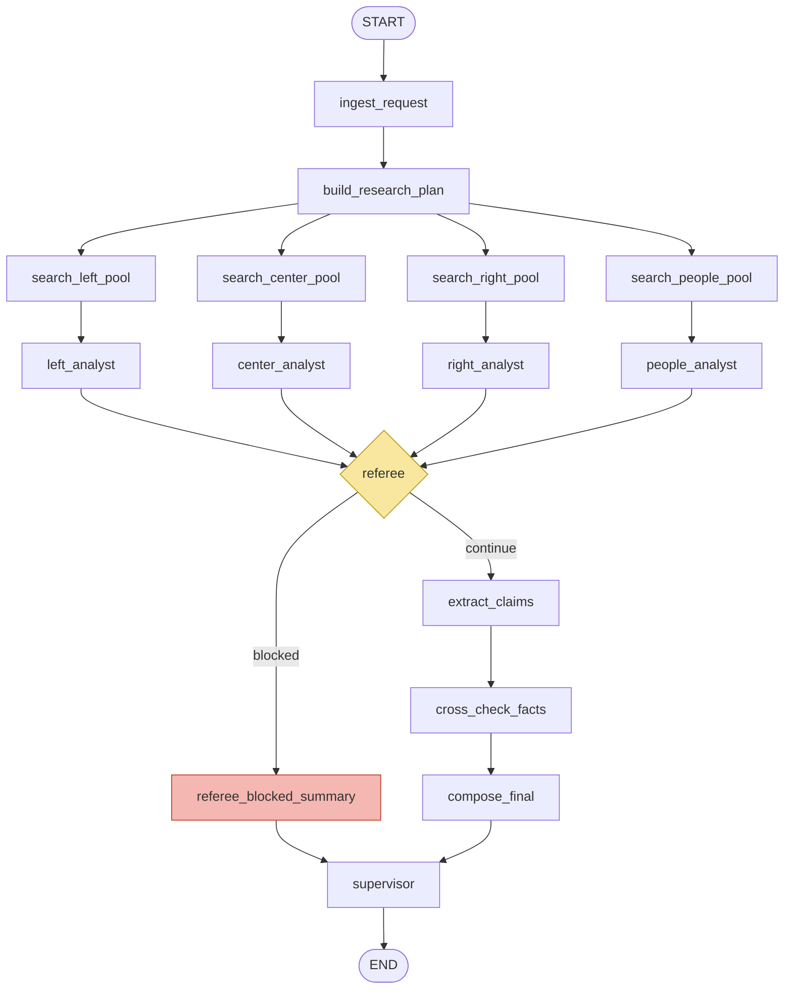

# GeopoliticAI — Agentic Pipeline Audit

**Date:** 2026-08-24
**Scope:** The LangGraph agentic workflow only (`app/src/graph.py`, `app/src/nodes/*`, `app/src/llm.py`, `app/src/search.py`, `app/src/planning.py`, `app/src/models.py`, and the two entrypoints that drive it, `app/src/api.py` and `app/src/cli.py`). Frontend, infra/deploy, and non-agentic plumbing are out of scope except where they directly affect how the graph is invoked.
**Method:** Static read-through of the full node graph and its supporting modules, cross-checked against LangGraph best practices (state design, node design, error handling, checkpointing, streaming, parallelism).

---

## 1. What the app is about

GeopoliticAI answers a political/geopolitical question by simulating a small newsroom: four ideologically-distinct analysts research the same query using **only pre-approved, curated sources**, a referee gates the output for quality, an independent fact-checker verifies every claim, and only claims that come back verified as `TRUE` are allowed into the final answer.

Concretely, a single query goes through:

1. **Ingestion & planning** — normalize the query, detect/accept a language (`english` or `polish`), build a naive research plan (a handful of query variants).
2. **Parallel lane search** — four independent Brave Search calls, each hard-restricted via `site:` filters *and* a post-hoc domain allow-list check to a curated source list per lane (`left`, `centrist`, `right`, `people`), separately for the English and Polish "infosphere" (`app/src/config.py`).
3. **Parallel lane analysis** — four LLM analysts turn each lane's sources into 3–5 short, source-cited claims, from that lane's ideological framing.
4. **Referee gate** — a lexical safety/quality check drops claims with no citation and blocks the whole run if any claim contains "loaded language" or if too few claims are supported.
5. **Fact-checking** — every surviving claim is independently verified (`TRUE` / `PARTIALLY TRUE` / `MISLEADING` / `FALSE`) against all collected sources plus a dedicated fact-check search lane.
6. **Compose & report** — the final synthesis is built **only from claims verdicted `TRUE`**; the supervisor node renders the user-facing markdown report (compact or full), including per-lane claims with verdict badges.

It ships as both a FastAPI service (`POST /api/run_pipeline` and an SSE `.../stream` variant) and a CLI (`src/cli.py`), sharing the same `graph.py` pipeline.

### 1.1 User-perspective flow

### 1.2 LangGraph topology

Notable structural facts, verified against `app/src/graph.py`:

- State type: a single flat `PipelineState(TypedDict)` (`app/src/models.py`) shared by every node — no subgraphs, no `Send` API (fan-out is static/fixed at 4 lanes, so plain parallel edges are the right call here, not a gap).
- Parallel writes are protected by `Annotated[list[...], operator.add]` reducers on every field four lanes write into (`*_sources`, `fact_checks`, `extracted_claims`) — this is required and correctly applied, since without it LangGraph's parallel super-step would silently drop three of the four lanes' results.
- Per-request configuration (language, infosphere source list, report mode) flows through `RunnableConfig["configurable"]` (see `nodes/runtime_config.py`), not through closures/`functools.partial` baked into node functions — every node is a plain, config-driven function.
- The graph has **no cycles**. It is a strict DAG with one conditional fork (`referee` → `continue` | `blocked`). This matters for the error-handling and recursion-limit discussion below.

---

## 2. What was made good

1. **Idiomatic node design.** Every node is a small, single-purpose function that takes `state` (+ optional `config`) and returns a partial-update `dict` — never mutates state in place. `build_research_plan_step`, `search_pools.py`, `supervisor.py` etc. are all one-responsibility wrappers around a pure implementation function, which also makes them trivially unit-testable in isolation (and the test suite does exactly that — see `tests/unit_tests/test_search_enforcement.py`).

2. **Reducers used correctly and only where needed.** The four parallel analyst/search lanes accumulate into `Annotated[list, operator.add]` fields; single-owner fields (`synthesis`, `final_output`, `referee_report`, `research_plan`) are plain overwrite fields. This is exactly the state-design split the best-practice guide calls for, and it's applied consistently.

3. **Routing kept out of node bodies.** `_route_after_referee` is a dedicated conditional-edge function returning a `Literal["continue", "blocked"]`, not logic buried inside the `referee` node — clean separation of "what happened" from "what to do next."

4. **Runtime config over closures.** Language/infosphere/report-mode are threaded via LangGraph's `RunnableConfig["configurable"]` and read back with small helpers (`nodes/runtime_config.py: runtime_language`, `runtime_infosphere_sources`, `runtime_report_mode`) instead of baking per-request values into node closures. This is safer under concurrency than the `functools.partial`-per-node pattern the older docs describe, and it means a single compiled graph object is theoretically reusable across languages (the code still recompiles per-request today — see §3.6 — but the state/config split already supports not needing to).

5. **Defense in depth on source provenance.** `search.py` restricts Brave queries with `site:` filters *and* re-validates every returned URL's domain against the lane's allow-list (`_url_matches_allowed_domains`) before accepting it — a single query-string trick can't leak an out-of-lane source into an analyst's context. Source IDs are lane-prefixed (`L1`, `C1`, `R1`, `P1`, `F1`) so merged citations can never collide across lanes.

6. **A real grounding discipline, not just a prompt instruction.** Claims are dropped post-hoc if their `source_ids` aren't in the lane's actual retrieved-source set (`_keep_claims_with_allowed_sources` in `generic_analyst.py`), and `compose_final` mechanically filters to only `verdict == "TRUE"` claims before writing the final answer (`_true_claims` in `compose_final.py`). This two-layer enforcement (retrieval-time domain filter + generation-time citation filter + synthesis-time verdict filter) is a genuinely careful anti-hallucination design, well beyond "trust the prompt."

7. **A pragmatic fix for a real structured-output failure mode.** `llm.py`'s `StructuredOutputChain` retries with escalating `max_completion_tokens` specifically when a JSON schema response gets truncated (`_is_length_limit_error`) — this is a known, easy-to-hit failure with small/cheap models on multi-field JSON schemas, and the fix targets it directly rather than generically retrying everything.

8. **Deterministic fallbacks instead of hard failures at the "claims" layer.** `generic_analyst_agent`'s retry → repair → source-fallback → minimal-fallback cascade guarantees a lane never returns zero claims (which would otherwise starve the referee/compose stages and produce a confusing "no claims" result) — a sensible design given the referee already blocks on unsupported claims, so the pipeline needs *some* claim to reason about even in a bad case.

9. **SSE streaming uses `astream_events(version="v2")`**, the currently-recommended granular streaming API, and maps `on_chain_start` events to localized (PL/EN) human-readable progress labels per node — reasonable UX for a pipeline whose steps take meaningfully different amounts of wall-clock time.

10. **Domain enforcement has direct unit-test coverage** (`tests/unit_tests/test_search_enforcement.py` asserts an out-of-scope Wikipedia hit is filtered while an allow-listed Brookings hit survives) — the single most safety-critical piece of retrieval logic is the one piece that's actually tested end-to-end at the function level.

---

## 3. What can be made better

Ordered roughly by how much it would change real-world reliability/debuggability.

### 3.1 No checkpointer is ever actually wired in
`build_graph()` and `run_pipeline()` both accept a `checkpointer` parameter, but grepping the whole `app/src` tree shows it is **never passed a value** — not in `api.py`, not in `cli.py`, not even an `InMemorySaver()` for dev. Every run is `graph.compile()` with no persistence layer at all. Consequences:
- A crash or restart mid-pipeline (after 4 searches + 4 LLM calls have already run) loses 100% of that work — nothing is resumable.
- The `thread_id` parameter plumbed all the way through `build_runtime_config(..., thread_id=...)` (`graph.py:53-71`) is **dead code** today: without a checkpointer, `thread_id` has no effect, so this parameter currently does nothing for either the CLI or the API caller.
- LangGraph Studio's time-travel / replay-from-checkpoint debugging (mentioned as a first-class debugging workflow in the LangGraph best-practice guide) isn't available on this pipeline in any environment, including local dev via `langgraph dev`.

**Fix:** wire at least an `InMemorySaver()` for `langgraph dev`/local runs, and a `PostgresSaver` (the app already runs Postgres for `prompt_logs` — `database.py`) for the FastAPI service, keyed by a per-request UUID as `thread_id`.

### 3.2 Inconsistent, mostly-absent error handling across nodes
There is no `RetryPolicy` on any `add_node(...)` call, and no `errors`/`error_count` state field — failures are handled ad hoc, and inconsistently, per node:
- `web_searcher` catches `httpx.HTTPError` **per domain** (good), but raises a bare `ValueError` if `BRAVE_SEARCH_KEY` is missing, which propagates uncaught all the way to the top.
- `cross_check_facts_agent` has **no try/except** around its single LLM call — a single OpenAI timeout or rate-limit here kills the entire pipeline run, discarding all 8 upstream searches + analyst calls.
- `compose_final_agent` **does** catch `Exception` around its LLM call and degrades gracefully to a deterministic fallback string — but silently, with only a `logger.warning`, no signal in state or in the API response that the answer quality was degraded.
- `generic_analyst_agent`'s 3-stage retry/repair cascade only retries for *empty/malformed claims*, not for transient network/API errors — an actual `httpx`/OpenAI exception there is not caught at all and still kills the run.

Net effect: whether a transient blip degrades gracefully, kills the run, or is silently invisible depends on which node it happens to hit — there's no consistent policy. On the API side, this shows up directly: `run_pipeline_endpoint` (`api.py:303-319`) only catches `ValueError`; any other exception (timeouts, rate limits, `httpx` errors from a fact-check search) becomes a raw unhandled 500.

**Fix:** add `RetryPolicy(max_attempts=3, ...)` on the search/LLM nodes per the "conservative for LLM, aggressive for tool calls" split from the best-practice guide, add a small `errors: Annotated[list[ErrorRecord], operator.add]` field to `PipelineState` so degraded/failed nodes leave a trace the supervisor (and API response) can actually surface to the caller, and catch broader exceptions in `run_pipeline_endpoint`.

### 3.3 `extract_claims` → `cross_check_facts` edge exists, but the data it produces is never read
`extract_claims_for_verification` (`nodes/extract_claims.py`) flattens all lane claims into `state["extracted_claims"]` — a list of dicts with `stmt_type`, `asserted_by`, `confidence`, etc. But `cross_check_facts_agent` (`nodes/cross_check_facts.py`) never reads `state["extracted_claims"]` at all; it independently re-derives `claims` by concatenating `state["left_claims"] + state["centrist_claims"] + ...` itself (line 119-124). The entire `extracted_claims` field — and the richer shape it was building (`stmt_type`, `confidence`, `asserted_by`) — is dead output: computed, stored, carried through state, and never consumed by anything downstream (nor rendered by `supervisor.py`).

**Fix:** either wire `cross_check_facts_agent` to actually consume `extracted_claims` (so the `stmt_type`/`confidence` fields become real signal, e.g. feeding verdict confidence), or delete the node and field if it was scaffolding for a feature that didn't land — as-is it's a maintenance trap for the next person who assumes it does something.

### 3.4 The referee's loaded-language gate has zero coverage for the Polish infosphere
`nodes/referee.py`'s `LOADED_TERMS` tuple is 10 hardcoded **English** words/phrases (`"traitor"`, `"vermin"`, `"subhuman"`, ...). The referee runs identically regardless of `state["language"]`, checking `claim.text.lower()` against this list. For any Polish-language run (`infosphere="polish"`, which is the **default** in `api.py`'s `RunPipelineRequest.infosphere` field), every claim text is Polish, so this term list will essentially never match — the safety/quality gate that's meant to block dehumanizing language is non-functional for the pipeline's default-configured language.

**Fix:** either localize `LOADED_TERMS` per language (mirroring how every other prompt/label in the codebase already branches on `language == "polish"`), or move this check to an LLM-based classifier that doesn't depend on a hardcoded term list at all.

### 3.5 No `recursion_limit` set, and no tests exercise the referee's routing branch
`graph.compile(...)` never passes `recursion_limit`, so it silently inherits LangGraph's default (25). Harmless today since the graph is a strict DAG with no cycles, but it means nobody has made a conscious decision here — the moment someone adds the natural next feature (e.g., "if referee blocks, loop back to research once with a rewritten plan" — a very likely next feature given the pipeline already computes *why* it blocked), the recursion guard will be whatever the library default happens to be rather than a deliberate choice.

Relatedly: `tests/integration_tests/test_graph.py` only asserts that a few expected node names exist in `graph.get_graph().nodes` — nothing in the test suite actually calls `graph.invoke(...)` end-to-end, and nothing exercises `_route_after_referee`'s `blocked` branch. `CLAUDE.md` itself calls out "if you change routing, also update `_route_after_referee`" as a thing to watch for, but there's no regression test that would catch a routing regression if someone did change it.

### 3.6 The graph is rebuilt from scratch on every single request
Both `run_pipeline()` and the streaming endpoint call `build_graph(infosphere=...)` per invocation (`api.py:238`, `graph.py:147`) — i.e., `StateGraph(...)`, all `add_node`/`add_edge` calls, and `.compile()` run fresh on every user query. Per §2.4, this is no longer strictly necessary: since `infosphere_sources`/`language`/`report_mode` already flow through `RunnableConfig` rather than through closures baked into the node functions at build time, the *same* compiled graph object could safely serve English and Polish requests, built once at process startup. Rebuilding per-request is pure wasted CPU on every API call.

### 3.7 Model selection is hardcoded and not tiered by task
`AGENT_MODEL_NAMES` in `config.py` pins **every** role — all four ideological analysts, `cross_check_facts`, and `compose_final` — to `"gpt-4o-mini"`. The `OPENAI_MODEL` env var only overrides the *fallback* used when a key isn't in the dict, not any of the six explicit entries, so there is currently no supported way to, say, run fact-checking (arguably the highest-stakes step, since `compose_final` trusts its verdicts unconditionally) on a stronger model without editing `config.py`. Given the pipeline's core value proposition is "verified claims only," the verification step being locked to the cheapest model with no override path is worth reconsidering.

### 3.8 No tracing/observability metadata attached to LLM calls
`CLAUDE.md` documents `LANGSMITH_API_KEY`/`LANGSMITH_PROJECT` as optional env vars, but no code sets `run_name`, `tags`, or `metadata` on any `invoke_structured_chain`/`StructuredOutputChain` call. Even with tracing enabled, every one of the ~10+ LLM calls in a single pipeline run (4 analysts × up to 3 retry stages + fact-check + compose) would show up in LangSmith as an anonymous `ChatOpenAI` call with no lane/node/language tag to filter or group by — exactly the kind of run where you'd want to filter "show me every `left_analyst` retry-cascade call for Polish queries this week."

### 3.9 Streaming never reaches token granularity
The SSE stream forwards only `on_chain_start` (for progress labels) and the final `on_chain_end` of the whole graph — never `on_chat_model_stream`. The user sees ~10 static "Analyzing left perspective..." ticks and then the entire final report appears in one paragraph-length JSON blob at the end, even though `compose_final`'s LLM call is exactly the kind of user-facing prose generation that token streaming was designed for.

---

## 4. Opportunities / paths for further development

Roughly in order of leverage relative to effort, given the current architecture:

1. **Turn the referee into a real human-in-the-loop gate, not just an auto-block.** The referee already computes *why* it would block (`unsupported_facts`, `loaded_language`) — today that just produces a canned "cannot answer" message (`summarize_referee_block`). This is the natural place to add an `interrupt()` node: pause, show a human editor the flagged claims, let them approve/edit/reject, then resume via `Command(resume=...)`. This directly needs a checkpointer (§3.1) to work at all, so it's a natural pairing with that fix.

2. **Close the loop on referee blocks instead of dead-ending.** Right now `blocked` routes straight to a static "no answer" message. A much stronger version: route back to `build_research_plan` (or directly to the affected lane's search) with the referee's specific gaps (`must_find`-style hints) fed back in, capped by an explicit `recursion_limit` and a `retry_count` state field, per the "retry loops — always cap iterations" pattern. This turns a hard failure into a self-correcting pipeline for the (likely common) case where a lane just didn't find enough citable material on the first pass.

3. **Add a long-term memory store for previously fact-checked claims.** Two different users asking about the same fast-moving news event today re-run all four lane searches and the fact-check search from scratch. An `InMemoryStore`/`PostgresStore` namespaced by claim text (or a semantic-similarity lookup) could short-circuit `cross_check_facts` for claims already verified recently, cutting both latency and Brave/OpenAI spend — and `database.py` already has a Postgres pool sitting right there for `prompt_logs`, so the infra half of this is already deployed.

4. **Make the referee model-based rather than lexical**, and localize it either way (§3.4). This is the smallest of the "opportunity" items but currently the highest-severity real gap, since it affects the pipeline's stated default language.

5. **Expose lane-level health in the final report.** Right now the report shows the resulting claims but nothing about whether a lane actually found real sources vs. hit the "no sources → 0 claims → minimal fallback claim" path in `generic_analyst_agent`. Surfacing `"left lane: 0 sources found, used fallback"` in the compact/full report (or as a distinct SSE event) would make it much easier for a user to tell "verified answer" from "pipeline degraded silently."

6. **Introduce token-level streaming for `compose_final`** (§3.9) — the single highest-value, lowest-effort UX change, since the infrastructure (`astream_events`) is already in place; it's a matter of also forwarding `on_chat_model_stream` events scoped to the `compose_final` node.

7. **Evaluate model tiering** (§3.7): run an eval (LangSmith dataset + the repo's existing `eval-engineering`-style tooling) comparing `gpt-4o-mini` vs. a stronger model specifically on the fact-check step, since that step's accuracy is the entire basis for what `compose_final` is allowed to say.

8. **Add an actual end-to-end regression test** that invokes `graph.invoke(...)` with mocked Brave/OpenAI responses and asserts on both the `continue` and `blocked` branches of `_route_after_referee` — closing the gap in §3.5 and giving `CLAUDE.md`'s "if you change routing, also update `_route_after_referee`" warning a test to actually enforce it.
