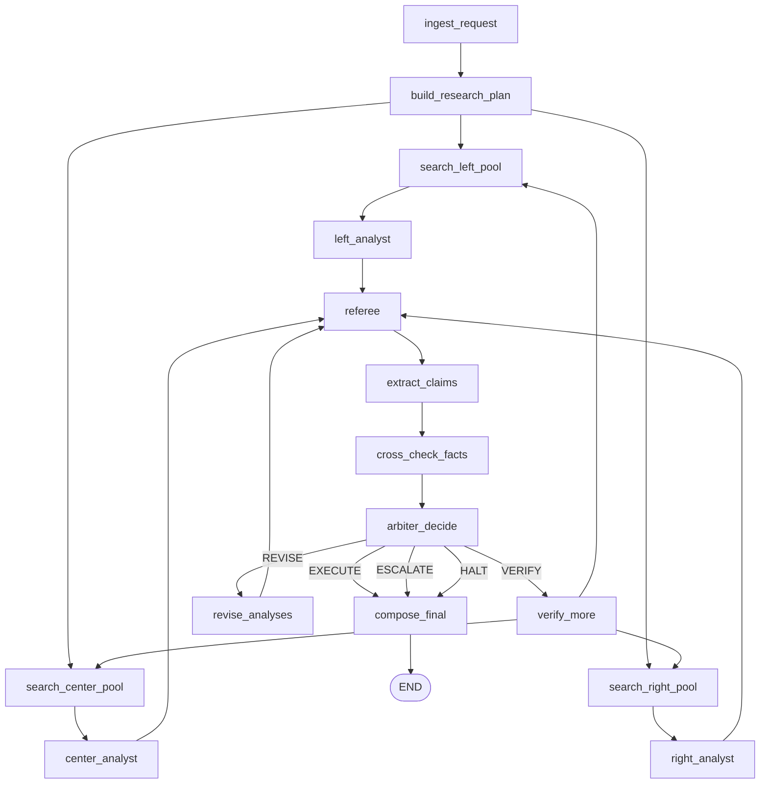
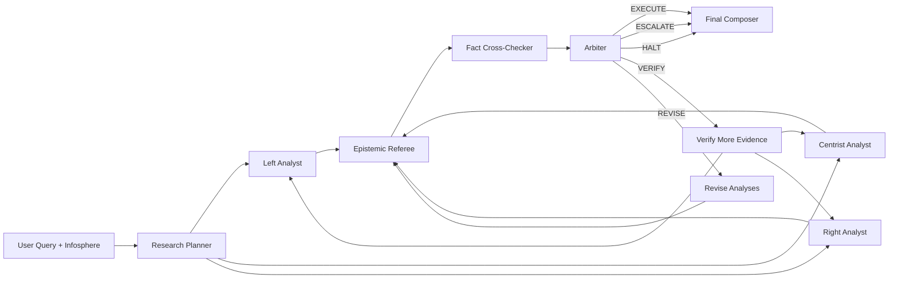

# MAGI-L/C/R adaptation plan for existing `geopoliticai` codebase

This document maps the requested MAGI-L/C/R architecture to the current implementation without rewriting the project from scratch.

## 1) Current baseline (what already exists)

The current pipeline already has:
- infosphere-aware source configuration (`english`/`polish`)
- lane-specific web searchers (`left`, `centrist`, `right`, plus `people` and `fact`)
- perspective claim generation
- fact-check stage
- neutral synthesis stage
- supervisor formatting the final response

So your requested architecture can be integrated as an evolution of the current graph, not a full rebuild.

## 2) Node-by-node mapping (requested -> existing code)

| Requested node | Keep/New | Existing hook in code | Adaptation notes |
|---|---|---|---|
| `ingest_request` | Keep | `run_pipeline()` initializes state | Add metadata fields (topic, constraints, loop counters) to state. |
| `build_research_plan` | New | no direct equivalent | New node before search that outputs `queries/entities/timeframe/must_find`. |
| `search_left_pool` | Keep (rename) | `left_searcher` in `graph.py` + `web_searcher()` | Use research plan queries + lane domains. |
| `search_center_pool` | Keep (rename) | `centrist_searcher` + `web_searcher()` | Same pattern as left. |
| `search_right_pool` | Keep (rename) | `right_searcher` + `web_searcher()` | Same pattern as left. |
| `left_analyst` | Keep (rename) | `build_claims(..., "leftist", ...)` | Enforce statement typing + steelman. |
| `center_analyst` | Keep (rename) | `build_claims(..., "centrist", ...)` | Enforce statement typing + steelman. |
| `right_analyst` | Keep (rename) | `build_claims(..., "right-wing", ...)` | Enforce statement typing + steelman. |
| `referee` | New | closest: `summarizer_judge` role semantics | Separate gate node that can block/rewrite/verify. |
| `extract_claims` | New | no direct equivalent | Build normalized claim objects from analyst statements. |
| `cross_check_facts` | Keep/Expand | `fact_checker()` | Change to claim-level support/conflict/insufficient result schema. |
| `arbiter_decide` | New | no direct equivalent | Decision node sets EXECUTE/VERIFY/REVISE/ESCALATE/HALT. |
| `verify_more` | New loop node | no direct equivalent | Runs targeted extra searches for missing verification. |
| `revise_analyses` | New loop node | no direct equivalent | Forces analysts to rewrite based on referee report. |
| `compose_final` | Keep/Expand | `supervisor_finalize` in `graph.py` | Include decision rationale, uncertainty, and audit trail. |

## 2.1) Visual graph (target MAGI-L/C/R flow)

Decision semantics:
- `EXECUTE`: quality threshold met, publish answer.
- `VERIFY`: gather additional evidence and re-run analysis/referee.
- `REVISE`: rewrite analyses to fix referee issues, then re-check.
- `ESCALATE`: publish with unresolved items + human-decision note.
- `HALT`: publish safe refusal / unable to answer reliably.

## 2.2) Agent-only visualization (quick view)

Compact flow:
`User -> Planner -> (Left | Center | Right) -> Referee -> Fact Cross-Checker -> Arbiter -> Final`

Loopbacks:
- `VERIFY` loops back into the analyst lanes with more evidence.
- `REVISE` loops back to referee after analyst rewrites.

## 3) Data model adaptation (minimal-disruption strategy)

### 3.1 Keep old state keys for compatibility
Keep existing keys initially (`left_claims`, `centrist_claims`, `right_claims`, etc.) so API and rendering do not break.

### 3.2 Add parallel MAGI keys
Add new optional keys (phase 1):
- `research_plan`
- `analysis_left`, `analysis_center`, `analysis_right`
- `referee_report`
- `extracted_claims`
- `verification_results`
- `decision`, `decision_rationale`
- `verification_to_do`, `rewrites_to_do`
- `audit_log`
- `loop_count`, `max_loops`

### 3.3 Extend `Source`
Current `Source` has only `id/title/url/notes`. Add optional fields to align with your spec:
- `publisher`, `published_at`, `snippet`, `content_excerpt`, `source_type`, `credibility_tier`, `lane`

These can be gradually populated from Tavily results.

## 4) Search layer changes

Current `web_searcher()` already accepts `agent_key` and reference domains.
Adapt it to:
1. Accept a list of planned queries from `research_plan`.
2. Merge lane pool + shared primary/mainstream pools.
3. Return richer `Source` metadata.
4. Score each source with heuristic credibility tier (A/B/C/D).

## 5) Analyst output contract

Update analyst prompts so each statement is structured as:
- `type`: `FACT | INTERPRETATION | VALUE | PREDICTION`
- `text`
- `citations` (URLs or source IDs)
- `confidence`

And add mandatory:
- `steelman_opposition`

This can be implemented by extending `build_claims()` output schema or introducing a new `build_lane_analysis()` helper.

## 6) Referee + Arbiter loop logic

### Referee checks
- unsupported FACT statements
- low-quality sourcing concentration
- loaded/inflammatory language
- missing steelman

### Arbiter decisions
- `EXECUTE`: evidence quality sufficient
- `VERIFY`: missing/contested facts -> run `verify_more`
- `REVISE`: language/logic issues -> run `revise_analyses`
- `ESCALATE`: unresolved normative conflict
- `HALT`: unsafe or unanswerable request

### Loop safety
- add `max_loops` (e.g., 2)
- if loops exhausted and still unresolved: `ESCALATE`

## 7) Concrete graph evolution from current code

### Phase A (low risk)
- keep current linear order in `graph.py`
- insert `build_research_plan` after entry
- insert `referee` before final summarization
- keep existing fact-check and synthesis

### Phase B (full MAGI flow)
- add claim extraction + cross-check as distinct nodes
- add `arbiter_decide` conditional edges
- add verify/revise loops

### Phase C (output hardening)
- update renderer to show statement types and confidence
- add final section: decision rationale + unresolved items

## 8) How this preserves existing functionality

User experience remains:
1. User chooses query + infosphere.
2. System returns left/centrist/right perspectives.
3. Fact-check section is included.
4. Final synthesis is included.

The adaptation improves rigor and governance without removing the current behavior.

## 9) Suggested implementation order (small PRs)

1. **State/model extension PR**: add optional metadata fields and new state keys.
2. **Research plan PR**: add planner node + query fanout into search.
3. **Analyst contract PR**: add statement typing + steelman fields.
4. **Referee/arbiter PR**: add decisions + conditional routing.
5. **Loop PR**: add verify/revise nodes with max loop guard.
6. **Rendering PR**: final formatting with audit and uncertainty display.

This sequence minimizes regressions and keeps each change testable.
